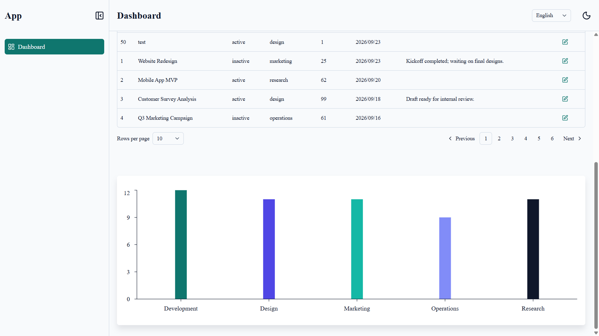
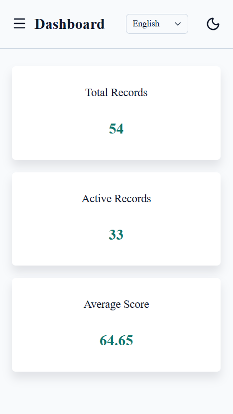
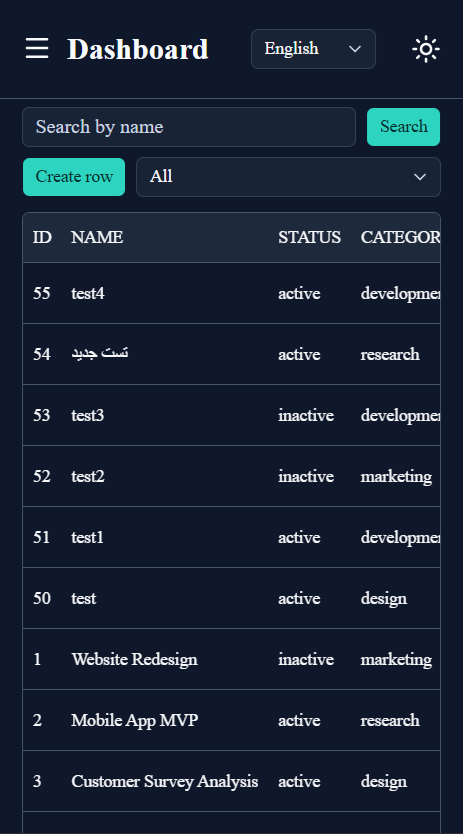
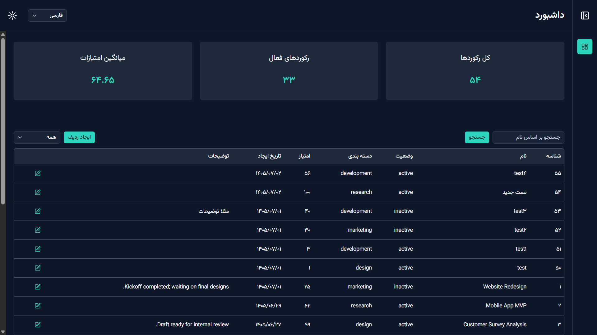
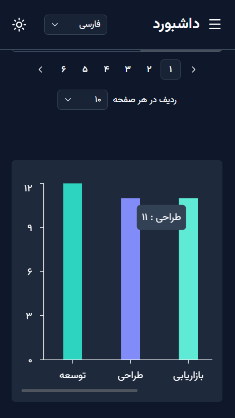

# Localized Management Dashboard

A modern management dashboard built with Next.js, TypeScript, and a localized UI for English and Persian users. The project focuses on bilingual usability, responsive layouts, and clear operational reporting for dashboard-style workflows.

## Overview

This dashboard is designed for managing records and presenting business data in a locale-aware interface. It supports dual-language navigation, RTL/LTR-aware layout behavior, localized date handling, and responsive charts and tables for desktop and mobile usage.

## Key Features

- English and Persian localization with full RTL/LTR adaptation
- Responsive dashboard layout for desktop and mobile screens
- Summary cards, charts, and table-based records management
- Locale-aware date and number formatting
- Clean component structure with reusable UI primitives
- Type-safe data handling with Zod, React Query, and Zustand

## Tech Stack

- Next.js 16
- React 19
- TypeScript
- Tailwind CSS
- shadcn/ui-inspired component system
- i18next and custom locale routing
- TanStack Query and Zustand
- Recharts for visualization

## Getting Started

### Prerequisites

- Node.js 18+
- pnpm 8+

### Installation

```bash
pnpm install
```

### Environment setup

Create a `.env.local` file if needed for local configuration:

```env
NEXT_PUBLIC_API_BASE_URL=http://localhost:3000
```

### Run in development mode

```bash
pnpm dev
```

Open http://localhost:3000 to view the app.

### Production build

```bash
pnpm build
pnpm start
```

## Quality Checks

```bash
pnpm lint
pnpm tsc
```

This project is intended to be a clean, maintainable foundation for localized dashboard interfaces and can be extended with additional features, APIs, and business rules as needed.

## Project Structure

```text
app/              # App routes and page layouts
components/       # Shared UI and layout components
features/         # Dashboard feature modules, hooks, forms, and tables
locales/          # Translation files for English and Persian
lib/              # Shared utilities and helpers
public/           # Static assets
screenshots/      # Repository screenshots used in the README
```

## Screenshots

### English





### Persian



